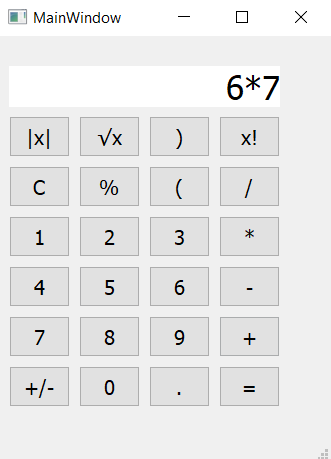

# Proje Adı: Basit Hesap Makinesi

Bu proje, Python'ın PyQt5 kütüphanesini kullanarak geliştirilmiş, temel aritmetik işlemleri yapabilen basit bir masaüstü hesap makinesidir.

### 📸 Ekran Görüntüsü



### ✨ Özellikler

- **Toplama, Çıkarma, Çarpma, Bölme, Mutlak Değer, Karekök, Mod Alma, Faktöriyel:** Matematiksel işlemleri gerçekleştirir.
- **Kullanıcı Dostu Arayüz:** Sayıları ve işlemleri kolayca girebilmeniz için basit ve anlaşılır bir kullanıcı arayüzüne sahiptir.
- **Ondalık İşlemler:** Ondalık sayılarla işlem yapabilir.
- **Temizleme Fonksiyonu:** Ekranı temizleme tuşu (C).

### 🛠 Kullanılan Teknolojiler

- **Programlama Dili:** Python 3
- **Kullanıcı Arayüzü Kütüphanesi:** PyQt5

### 🚀 Kurulum ve Çalıştırma

Bu projeyi bilgisayarınızda çalıştırmak için aşağıdaki adımları takip edin:

1.  **Gerekli Kütüphaneyi Kurun:**
    Terminalinizi açın ve `PyQt5` kütüphanesini yüklemek için aşağıdaki komutu çalıştırın:

    ```bash
    pip install PyQt5
    ```

2.  **Depoyu Klonlayın:**
    Proje dosyalarını indirmek için Git'i kullanarak depoyu klonlayın:

    ```bash
    git clone [https://github.com/Tugbakaraman/PyQt5-BasitHesapMakinesi.git](https://github.com/Tugbakaraman/PyQt5-BasitHesapMakinesi.git)
    ```

3.  **Proje Klasörüne Gidin:**

    ```bash
    cd pyqt5-hesap-makinesi
    ```

4.  **Uygulamayı Çalıştırın:**
    Aşağıdaki komutla hesap makinesi uygulamasını başlatın:
    ```bash
    python main.py
    ```
